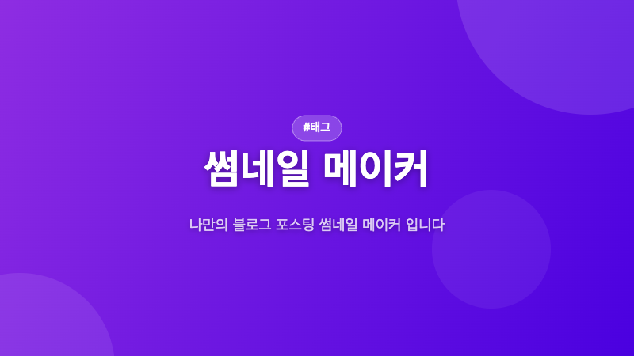

# 블로그 썸네일 메이커

블로그 포스팅용 800×450 썸네일을 브라우저 확장에서 바로 만들고 PNG로 저장하는 크롬 확장 프로그램입니다.

- [개발 일지 보러가기](https://jeongsangin1.tistory.com/entry/%EB%B8%94%EB%A1%9C%EA%B7%B8-%EC%8D%B8%EB%84%A4%EC%9D%BC-%EB%A9%94%EC%9D%B4%EC%BB%A4-%EC%9D%B5%EC%8A%A4%ED%85%90%EC%85%98-%EA%B0%9C%EB%B0%9C-%EA%B8%B0%EB%A1%9D)

---

## 사용 예시

## 출력 결과

---

## 설치 방법

Chrome Web Store 배포 심사 중...

---

## 사용 방법

| 단계 | 설명                                                          |
| ---- | ------------------------------------------------------------- |
| 1    | 크롬 툴바의 확장 아이콘 클릭                                  |
| 2    | **제목 / 부제목 / 태그** 입력                                 |
| 3    | 원하는 **테마 색상** 선택 (10가지 프리셋 제공)                |
| 4    | 폰트, 글자 크기, 텍스트 정렬, 그라디언트 방향, 장식 패턴 조정 |
| 5    | 미리보기 확인 후 **PNG 저장** 버튼 클릭                       |

### 커스터마이징 옵션

- **테마** — Royal / Ocean / Purple / Fire / Forest / Sunset / Mint / Gold / Rose / Dark
- **그라디언트 방향** — 대각선 / 가로 / 세로 / 원형
- **장식 패턴** — 원 / 점 / 사선 / 기하학
- **텍스트 정렬** — 좌 / 중앙 / 우
- **직접 색상 지정** — 시작 색상, 끝 색상, 텍스트 색상 모두 커스텀 가능

---

## 기술 스택

- Vanilla JavaScript (Canvas API)
- HTML / CSS
- Chrome Extensions Manifest V3
